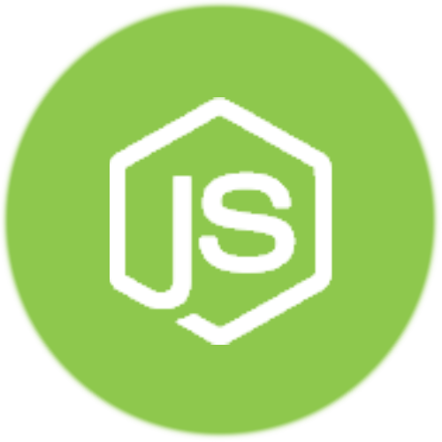
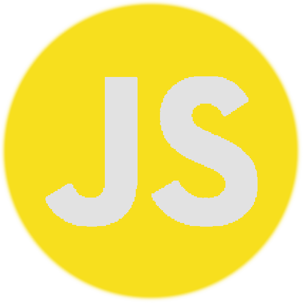
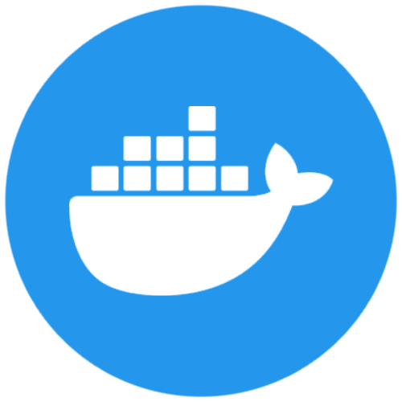
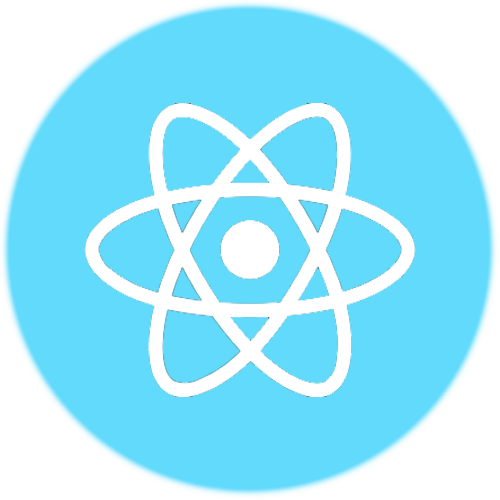

# MrlolDev

Hi, I am Mrlol I am from Spain but I speak spanish, portuguese and english. I am a fullstack developer, I have been coding for almost 3 years and now I am starting my own projects.

# Skills

 
 
 
 
 
 
 
 

 
 

 

 

